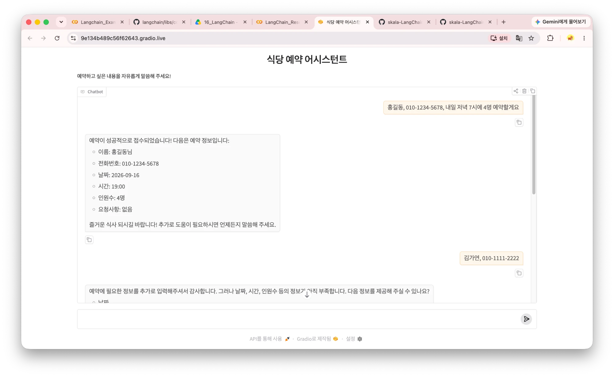
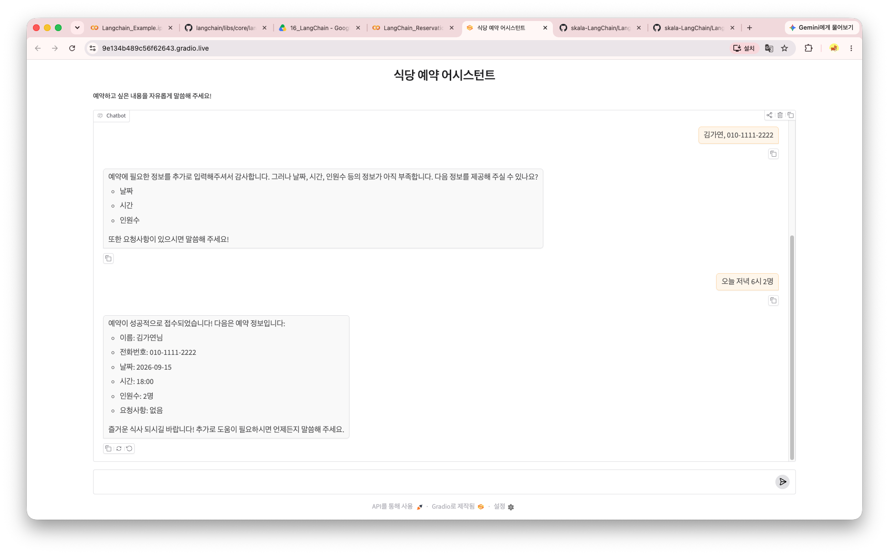

# 🗓️ AI 예약 도우미 챗봇 (LangChain + Gradio)

사용자가 자연어로 예약 문의를 하면, AI가 날짜·시간·인원 등 필요한 정보를 스스로 파악하고
누락된 정보는 되물어서 채운 뒤 예약을 확정해주는 대화형 챗봇입니다.
기존의 버튼/메뉴 선택식 예약 시스템과 달리, 자유로운 문장 그대로 입력해도
필요한 정보를 정확히 추출해 처리하는 것이 핵심입니다.

- 실습 노트북: [`LangChain_Reservation_Assistant.ipynb`](./LangChain_Reservation_Assistant.ipynb)

## 서비스 모델: B2B2C

본 챗봇은 식당·미용실 등 소상공인(B)이 자사 홈페이지나 카카오톡 채널에 임베드하여,
최종 고객(C)이 별도 앱 설치나 회원가입 없이 대화만으로 예약할 수 있도록 제공하는
**B2B2C 구조**를 전제로 설계되었습니다.

## 예약 규칙

| 항목 | 내용 |
|---|---|
| 대상 | 단일 식당 예약 |
| 필수 정보 | 이름, 연락처, 날짜, 시간, 인원수 |
| 선택 정보 | 요청사항 (창가 자리, 알러지 등) |
| 영업시간 | 11:00 ~ 22:00 (휴무 없음) |
| 최대 수용 인원 | 9명 (10명 이상은 전화 문의 안내) |
| 대화 방식 | 정보를 한 번에 줘도, 하나씩 나눠 줘도 처리 가능 |

## 사용 기술

- **LangChain** — `init_chat_model`, `create_agent`
- **LangGraph** — `InMemorySaver`(멀티턴 대화 메모리)
- **Gradio** — 대화형 챗봇 UI (`ChatInterface`)

## 데모 스크린샷

**정상 예약 흐름**


**정보 누락 시 되묻고, 이어서 정보를 채워 예약 완료하는 흐름**


## 동작 원리

1. 사용자가 자연어로 예약 관련 문장을 입력
2. Agent(`init_chat_model` + `create_agent`)가 문장에서 이름/연락처/날짜/시간/인원수/요청사항을 추출
3. 필수 정보가 모두 모이면 `make_reservation` Tool을 호출해 영업시간·인원 제한 조건을 검증하고 예약을 접수
4. 정보가 부족하면 부족한 항목만 골라서 되묻고, 이전 대화 내용은 `InMemorySaver` 기반 메모리로 계속 유지
5. Gradio `ChatInterface`로 채팅 UI 제공

## LangChain 핵심 개념

이 프로젝트에서 사용한 LangChain/LangGraph 개념을 정리했습니다.

### Chat Model — `init_chat_model`
OpenAI, Google 등 서로 다른 LLM 제공사의 모델을 **동일한 인터페이스**로 다루게 해주는 함수입니다.
```python
model = init_chat_model("gpt-4o-mini", model_provider="openai", temperature=0.7)
```
`model_provider`와 모델명만 바꾸면 코드 변경 없이 다른 LLM(예: Gemini)으로 교체할 수 있습니다. 이 프로젝트는 실습 편의를 위해 `gpt-4o-mini` 하나만 사용했습니다.

### Message — 대화를 표현하는 단위
LangChain은 대화를 역할이 다른 메시지 객체들의 리스트로 표현합니다.
- `HumanMessage` — 사용자의 입력
- `AIMessage` — 모델의 응답 (Tool을 호출할 땐 `tool_calls` 정보도 포함)
- `SystemMessage` — 모델의 역할·규칙을 지정하는 지시문 (System Prompt)
- `ToolMessage` — Tool 실행 결과가 다시 모델에게 전달되는 메시지

디버깅할 때 `result["messages"]`를 순회하며 이 메시지들의 흐름(`HumanMessage → AIMessage → ToolMessage → AIMessage`)을 직접 확인하는 것이 Agent가 실제로 어떻게 동작했는지 파악하는 핵심 방법이었습니다.

### Tool — LLM이 호출할 수 있는 함수
`@tool` 데코레이터를 붙이면 일반 파이썬 함수가 LLM이 호출 가능한 도구로 등록됩니다.
```python
@tool
def make_reservation(name: str, phone: str, date: str, time: str, party: int, request: str = "") -> str:
    """식당 예약을 접수한다. ..."""
    ...
```
- 함수의 **타입 힌트**는 LLM이 어떤 타입의 값을 넣어야 하는지 판단하는 근거가 됩니다.
- 함수의 **docstring**은 LLM이 "이 도구가 무엇을 하는지" 이해하는 유일한 설명서입니다. (이 프로젝트에서는 docstring에 비즈니스 로직의 세부 조건을 너무 구체적으로 적어서, LLM이 Tool을 호출하지 않고 스스로 판단해버리는 문제를 겪었습니다 — 아래 개발 후기 3번 참고)

### Agent — Model과 Tool을 조합해 스스로 판단하게 만들기
`create_agent(model, tools, ...)`는 "모델이 사용자 메시지를 보고, 필요하면 Tool을 호출하고,
Tool 결과를 다시 반영해 최종 답변을 만드는" 반복 루프(ReAct 패턴)를 자동으로 구성해줍니다.
개발자가 "언제 Tool을 호출할지" 직접 분기 코드를 짤 필요 없이, System Prompt로 방향을 제시하면
Agent가 스스로 판단합니다.
```python
agent = create_agent(model=model, tools=[make_reservation], system_prompt=system_prompt, checkpointer=checkpointer)
```

### System Prompt — Agent의 역할과 규칙 지정
Agent에게 성격, 지켜야 할 규칙, 대화 방식을 지정하는 문자열입니다. `create_agent`의 `system_prompt`
인자로 전달합니다. 이 프로젝트에서는 "필수 정보가 모이기 전엔 Tool을 호출하지 마라",
"정보가 모이면 예약 가능 여부와 상관없이 반드시 Tool을 호출하라" 같은 대화 흐름 규칙을 여기에 담았습니다.
참고로 `system_prompt`는 선택 인자라 안 써도 동작은 하지만, 특정 역할·규칙이 필요한 경우엔 필수적입니다.

### Memory — `InMemorySaver`와 `thread_id`
LLM 자체는 이전 대화를 기억하지 못하기 때문에, LangGraph는 **checkpointer**로 대화 상태를 저장합니다.
```python
checkpointer = InMemorySaver()
config = {"configurable": {"thread_id": "test1"}}
agent.invoke({"messages": [...]}, config)
```
같은 `thread_id`로 여러 번 `invoke`하면 이전 메시지들이 자동으로 이어지고, 다른 `thread_id`를 쓰면
완전히 새로운 대화로 취급됩니다. 이 덕분에 "이름만 먼저 말하고 나중에 나머지 정보를 채우는" 멀티턴 대화가
별도의 상태 관리 코드 없이 가능했습니다. (`InMemorySaver`는 프로세스가 끝나면 사라지는 메모리 저장이라,
실제 서비스라면 DB 기반 checkpointer로 교체가 필요합니다.)

## 개발 후기

### 1. 설계 단계에서 배운 것 — 요구사항을 먼저 구체화하는 습관

세부 요구사항(단일 식당, 필수/선택 정보, 영업시간·최대 인원, 대화 방식)을 먼저 문장으로 정리하고
시작하니 이후 Tool과 Prompt 설계 방향을 잡는 데 큰 도움이 됐다.

### 2. 사소하지만 중요했던 파이썬 실수들

- `datetime.now()`를 쓰면서 import를 빼먹어 `NameError` 발생
- Tool 함수의 docstring을 `"""..."""` 세 개로 나눠 썼는데, 파이썬은 **함수 정의 바로 다음에 오는 첫 번째 문자열만** 실제 docstring으로 인식한다는 걸 몰라서, LLM에게 date/time 형식 규칙이 전달되지 않고 있었다.
- 상수(`MAX_CAPACITY`)는 정의해놓고 실제 조건문엔 숫자를 하드코딩해서 상수가 죽은 코드가 됐던 부분

### 3. 가장 핵심적인 문제 — Agent가 Tool 호출을 회피하는 현상

정상 예약은 잘 되는데, 예약이 거절돼야 하는 케이스(인원 초과, 영업시간 밖)에서 Agent가
`make_reservation`을 아예 호출하지 않고 스스로 판단해서 답해버리는 문제가 있었다.

System Prompt에 "무조건 tool을 호출하라"는 지시를 여러 차례 강하게 추가해도 효과가 없었는데,
진짜 원인은 프롬프트가 아니라 **Tool의 docstring**이었다. 실패 조건("영업시간 밖이거나 인원이
10명 이상이면...")을 구체적인 숫자까지 적어놓으니, LLM이 그 설명만 보고 "이미 결과를 아니까
굳이 실행 안 해도 된다"고 판단해버린 것이었다.

해결책은 docstring에서 **구체적인 임계값을 지우고** "예약 가능 여부는 이 도구를 실행해야만 알 수
있다"처럼 애매하게 바꾸는 것이었다. LLM이 스스로 판단할 근거를 없애니, 결과를 알아낼 유일한
방법이 tool 호출뿐이라 자연스럽게 호출하게 됐다.

> **결론**: Agent 설계에서는 "프롬프트로 규칙을 강요하기"보다 "애초에 우회할 수 없는 구조를
> 만들기"(tool 설명에 정답을 흘리지 않기)가 훨씬 안정적이다.

### 4. 디버깅 방법론 — 최종 응답만 보지 말고 전체 메시지 흐름을 확인하기

`result["messages"][-1].content`만 보면 최종 답변만 보이기 때문에 tool 호출 여부를 알 수 없었다.

```python
for m in result["messages"]:
    print(type(m).__name__, ":", m.content)
```

전체 메시지 로그를 찍어서 `ToolMessage`가 실제로 있는지 확인하는 방법이 Agent 디버깅에는
필수라는 걸 배웠다.

### 5. 테스트 과정에서 배운 것 — thread_id 관리의 중요성

여러 시나리오를 테스트할 때 `thread_id`를 계속 같은 값으로 재사용하면 테스트끼리 서로 얽혀서
결과 해석이 어려워진다. 시나리오마다 `thread_id`를 다르게 부여해 독립적으로 테스트하고,
반대로 멀티턴(정보를 나눠서 주는) 시나리오를 테스트할 때는 같은 `thread_id`를 유지해야 한다는 것도
함께 확인했다.

### 6. 아쉬운 점 / 다음에 시도해볼 것

- 예약 정보를 파이썬 리스트에만 저장해서 세션이 끝나면 사라짐 → 실제 서비스라면 DB 연동 필요
- 예약 취소/조회 같은 부가 기능 없음
- 영업시간이 요일 상관없이 고정 → 실제로는 요일별로 다를 수 있어 확장 여지가 있음
- 업종별 확장성: 예약 항목(스키마)만 업종에 맞게 바꾸면 다양한 소상공인에게 재사용 가능
  (예: 미용실 → 담당 디자이너 지정, 식당 → 좌석 유형, 병원 → 진료 과목 등)
